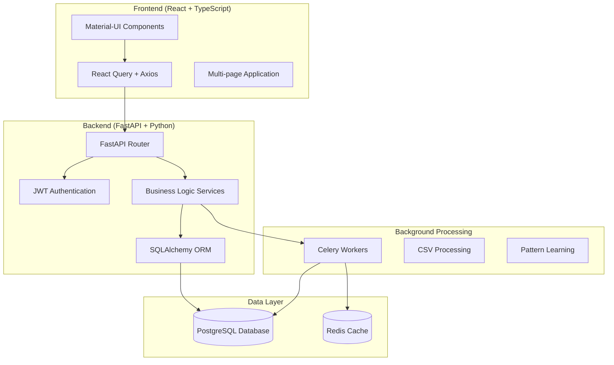

# 🏦 BudgetLens - AI-Powered Personal Finance Manager

<div align="center">


**Your intelligent financial autopilot for Swiss banking and beyond**

[](LICENSE)
[](https://python.org)
[](https://reactjs.org)
[](https://fastapi.tiangolo.com)
[](https://docker.com)

</div>

## 🌟 Features

### 💳 **Multi-Account Management**
- Support for multiple bank accounts (Checking, Savings, Credit Cards, Investments)
- Real-time balance tracking with manual adjustment capabilities
- Smart account assignment for transactions

### 🔄 **Intelligent Transfer Detection**
- Automatic detection of transfers between accounts
- Confidence scoring to prevent double-counting
- Automatic matching with manual review options

### 🧠 **Smart Transaction Categorization**
- Machine learning-based vendor pattern recognition
- Auto-categorization of similar transactions
- Support for Swiss banking formats (ZKB, Cornercard)

### 📊 **Budget Management**
- Monthly budget planning and tracking
- Daily allowance calculations
- Visual spending analytics with charts

### 📁 **CSV Import System**
- Robust CSV processing with Swiss bank support
- Auto-detection of file formats
- Comprehensive error handling and reporting

### 🔍 **Review & Analytics**
- Transaction review queue with AI suggestions
- Learned pattern visualization
- Upload management and history

## 🚀 Quick Start

### Prerequisites

- **Docker & Docker Compose** (recommended)
- **Git**
- **Node.js 18+** (for local development)
- **Python 3.11+** (for local development)

### 🐳 Docker Setup (Recommended)

1. **Clone the repository**
   ```bash
   git clone https://github.com/EricStautmeister/budgetlens.git
   cd budgetlens
   ```

2. **Create environment file**
   ```bash
   cp .env.example .env
   ```
   
   Edit `.env` with your configuration:
   ```env
   # Security
   SECRET_KEY=your-super-secret-key-here-make-it-long-and-random
   JWT_SECRET=your-jwt-secret-key-here-also-make-it-random
   
   # Database
   DATABASE_URL=postgresql://user:pass@db:5432/budgetapp
   
   # Optional: Encryption for sensitive data
   ENCRYPTION_KEY=your-encryption-key-here
   
   # Development
   ENVIRONMENT=development
   ```

3. **Start all services**
   ```bash
   docker-compose up -d
   ```

4. **Wait for services to start** (about 30 seconds)
   ```bash
   # Check status
   docker-compose ps
   ```

5. **Access the application**
   - 🌐 **Frontend**: http://localhost:3000
   - 🔧 **Backend API**: http://localhost:8000
   - 📚 **API Docs**: http://localhost:8000/docs

### 🔧 Local Development Setup

<details>
<summary>Click to expand local development instructions</summary>

#### Backend Setup

1. **Navigate to backend directory**
   ```bash
   cd backend
   ```

2. **Create virtual environment**
   ```bash
   python -m venv venv
   source venv/bin/activate  # On Windows: venv\Scripts\activate
   ```

3. **Install dependencies**
   ```bash
   pip install -r requirements.txt
   ```

4. **Set up database**
   ```bash
   # Start PostgreSQL with Docker
   docker run -d --name budgetlens-db \
     -e POSTGRES_USER=user \
     -e POSTGRES_PASSWORD=pass \
     -e POSTGRES_DB=budgetapp \
     -p 5432:5432 postgres:15
   ```

5. **Run migrations**
   ```bash
   alembic upgrade head
   ```

6. **Start backend server**
   ```bash
   uvicorn app.main:app --reload --host 0.0.0.0 --port 8000
   ```

#### Frontend Setup

1. **Navigate to frontend directory**
   ```bash
   cd frontend
   ```

2. **Install dependencies**
   ```bash
   npm install
   ```

3. **Start development server**
   ```bash
   npm run dev
   ```

</details>

## 🏗️ Architecture



## 📖 Usage Guide

### 🔐 Getting Started

1. **Register an account** at http://localhost:3000/register
2. **Create your first bank account** in the Accounts section
3. **Upload a CSV file** from your bank to import transactions
4. **Review and categorize** transactions in the Review Queue
5. **Set up budgets** for your spending categories

### 💾 Supported Bank Formats

#### Swiss Banks
- **ZKB (Zurich Kantonal Bank)** - Auto-detected
- **Cornercard Swiss** - Auto-detected
- **Generic CSV** - Manual mapping available

#### CSV Format Requirements
- Date column (various formats supported)
- Amount or separate Debit/Credit columns
- Description/Transaction text
- Optional: Account information

### 🎯 Key Workflows

#### Transaction Categorization
1. Upload CSV file from your bank
2. Transactions appear in Review Queue
3. Categorize transactions manually or use AI suggestions
4. System learns patterns for future auto-categorization

#### Transfer Management
1. Navigate to Transfers section
2. Click "Detect Transfers" to find potential transfers
3. Review and confirm suggested matches
4. High-confidence matches are auto-confirmed

#### Budget Planning
1. Create spending categories
2. Set monthly budget amounts
3. Monitor spending with visual charts
4. Track daily allowances

## 🛠️ Development

### 🧪 Running Tests

```bash
# Backend tests
cd backend
pytest

# Frontend tests  
cd frontend
npm test
```

### 📊 Database Management

#### Reset Database (Nuclear Option)
```bash
./db_reset.sh
```

#### Verify Reset
```bash
./db_reset_verification.sh
```

#### Create Migration
```bash
cd backend
alembic revision --autogenerate -m "Description of changes"
alembic upgrade head
```

### 🔍 API Documentation

The FastAPI backend automatically generates interactive API documentation:
- **Swagger UI**: http://localhost:8000/docs
- **ReDoc**: http://localhost:8000/redoc

### 🐛 Debugging

#### View Logs
```bash
# All services
docker-compose logs -f

# Specific service
docker-compose logs -f backend
docker-compose logs -f frontend
```

#### Database Access
```bash
# Connect to PostgreSQL
docker-compose exec db psql -U user -d budgetapp

# View tables
\dt

# Example query
SELECT * FROM users;
```

## 🔧 Configuration

### Environment Variables

| Variable | Description | Default | Required |
|----------|-------------|---------|----------|
| `SECRET_KEY` | Application secret key | - | ✅ |
| `JWT_SECRET` | JWT token secret | - | ✅ |
| `DATABASE_URL` | PostgreSQL connection string | - | ✅ |
| `ENCRYPTION_KEY` | Data encryption key | - | ❌ |
| `ENVIRONMENT` | Runtime environment | `development` | ❌ |
| `CELERY_BROKER_URL` | Redis URL for Celery | `redis://redis:6379/0` | ❌ |

### Docker Configuration

The `docker-compose.yml` includes:
- **Backend**: FastAPI server with hot reload
- **Frontend**: React development server
- **Database**: PostgreSQL 15 with persistent storage
- **Cache**: Redis for sessions and background tasks
- **Worker**: Celery for background processing

## 🔒 Security Features

- **JWT Authentication** with refresh tokens
- **Password hashing** using bcrypt
- **Optional data encryption** for sensitive information
- **CORS protection** with configurable origins
- **SQL injection prevention** via SQLAlchemy ORM

## 🌍 Multi-Network Support

The application supports various network configurations:

### Local Development
- Frontend: `http://localhost:3000`
- Backend: `http://localhost:8000`

### Network Access
- Configure `VITE_API_URL` in frontend environment
- Update CORS settings in backend for production

## 📝 Contributing

1. **Fork the repository**
2. **Create a feature branch**: `git checkout -b feature/amazing-feature`
3. **Commit changes**: `git commit -m 'Add amazing feature'`
4. **Push to branch**: `git push origin feature/amazing-feature`
5. **Open a Pull Request**

### Code Style
- **Python**: Follow PEP 8, use type hints
- **TypeScript**: Use strict mode, follow React best practices
- **Commits**: Use conventional commit messages

## 🚨 Troubleshooting

### Common Issues

#### Port Already in Use
```bash
# Check what's using the port
lsof -i :3000
lsof -i :8000

# Kill the process
kill -9 <PID>
```

#### Database Connection Issues
```bash
# Reset database completely
./db_reset.sh

# Check database status
docker-compose exec db pg_isready -U user
```

#### Frontend Not Loading
```bash
# Clear Docker cache
docker-compose down
docker system prune -f
docker-compose up --build
```

#### CSV Upload Errors
- Ensure file is valid CSV format
- Check for special characters in file
- Verify account exists before upload
- Review error details in Upload Management

## 📊 Performance

### Optimization Tips
- Use connection pooling for database
- Enable Redis caching for frequent queries
- Implement pagination for large transaction lists
- Use database indexing for search operations

### Monitoring
- Monitor Docker container resource usage
- Check PostgreSQL query performance
- Review Celery task execution times

## 📚 Technical Stack

### Backend
- **FastAPI** - Modern Python web framework
- **SQLAlchemy** - Database ORM
- **Alembic** - Database migrations
- **Celery** - Background task processing
- **PostgreSQL** - Primary database
- **Redis** - Caching and message broker

### Frontend
- **React 18** - UI framework
- **TypeScript** - Type safety
- **Material-UI** - Component library
- **React Query** - Data fetching
- **Vite** - Build tool and dev server

### Infrastructure
- **Docker** - Containerization
- **Docker Compose** - Multi-container orchestration
- **Nginx** - Production web server (in frontend container)

## 📄 License

This project is licensed under the MIT License - see the [LICENSE](LICENSE) file for details.

## 🙏 Acknowledgments

- Swiss banking institutions for CSV format inspiration
- Open source community for excellent tools and libraries
- FastAPI and React communities for documentation and examples

---

<div align="center">

**Built with ❤️ by Eric Stautmeister**

[Report Bug](https://github.com/EricStautmeister/budgetlens/issues) • [Request Feature](https://github.com/EricStautmeister/budgetlens/issues) • [Documentation](https://github.com/EricStautmeister/budgetlens/wiki)

</div>